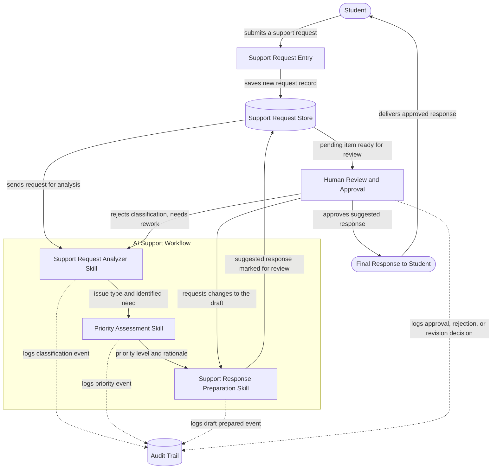

# Architecture: Student Support Workflow Assistant

## 1. The Idea

Student Support Workflow Assistant — An AI-powered support assistant for online students learning technical topics such as AI, Claude, APIs, MCP, and Agent Skills. When a student gets stuck understanding a concept or completing coursework, they can submit a support request. The AI reads the request, identifies the type of issue and its urgency, and prepares a suggested response or summary. However, the AI does not act on its own — a human reviewer must check and approve the result before it is finalized.

---

## 2. Components

| Component | What it does for this project | Exact words from the project idea that required this component |
|---|---|---|
| **Support Request Entry** | Gives the student a place to describe what they're stuck on and send that description into the system. | "they can submit a support request" |
| **Support Request Store** | Holds each request, and everything the AI produces about it, in one place from the moment it's submitted until a human has reviewed it — nothing can be "checked before it's finalized" if there's nowhere to hold it while it waits. | "a human reviewer must check and approve the result before it is finalized" |
| **AI Support Workflow** | The pipeline that takes a stored request and runs it through reading, classifying, prioritizing, and drafting, in order, without acting on the result itself. | "The AI reads the request, identifies the type of issue and its urgency, and prepares a suggested response or summary" |
| **Human Review and Approval** | Gives a real person the chance to look at what the AI produced — the classification, the urgency, the draft response — and approve it, send it back, or fix it before it goes anywhere near the student. | "the AI does not act on its own — a human reviewer must check and approve the result before it is finalized" |
| **Audit Trail** | Keeps a record of what the AI decided, what the reviewer decided, and when, so the human-approval control above is provable after the fact and not just assumed to have happened. | Inferred from "a human reviewer must check and approve the result before it is finalized" — see Assumptions (§7) for why this is an inference rather than a literal quote. |

Five components. Each is either named directly in the idea or is infrastructure that the named requirement cannot function without. Issue classification, priority assessment, and response drafting are **not** listed here as separate components — they are the three Skills the AI Support Workflow runs, detailed in §3.

---

## 3. Skills

| Skill | Purpose | Input | Output | When it runs | What it must NOT do | How it connects to the other Skills |
|---|---|---|---|---|---|---|
| **Support Request Analyzer Skill** | Reads the student's request and works out what they actually need help with, then classifies the type of issue. | The raw request text (plus basic metadata: student id, course/topic, timestamp). | A structured record: issue type/category, and a short statement of what the student needs. | First. Runs as soon as a new request is stored, before any other Skill touches it. | Must not assess urgency or priority, must not draft a response, must not decide what happens to the student. | Passes its structured output forward to the Priority Assessment Skill. Receives requests looped back to it if a human reviewer rejects the classification as wrong. |
| **Priority Assessment Skill** | Determines how urgent the request is, using the request itself plus the Analyzer's classification. | The original request + the Analyzer's issue-type output. | A priority level (e.g. low / medium / high / urgent) with a short rationale. | Second — after classification, before response preparation. | Must not make the final decision about what happens to the student; must not decide the content of the response; must not skip straight to drafting. | Receives its input from the Support Request Analyzer Skill. Passes its priority output forward to the Support Response Preparation Skill. |
| **Support Response Preparation Skill** | Prepares a suggested response, explanation, or summary that answers what the student asked, shaped by the issue type and priority already determined. | The original request + the Analyzer's classification + the Priority Assessment Skill's priority level. | A draft response, explanation, or summary, explicitly labeled as a suggestion pending human review. | Third — last in the AI Support Workflow, only after both classification and priority exist. | Must not send the response directly to the student; must not remove or hide the "suggestion, not final" label; must not present itself as the final answer. | Receives its input from the Priority Assessment Skill. Hands its labeled draft to the human Review and Approval step (not another Skill — a person). Receives requests looped back to it if a human reviewer asks for a revised draft. |

No fourth Skill is introduced. Routing a rejected item back to the Analyzer (reclassification) versus back to the Response Preparation Skill (a revised draft only) is a decision the human reviewer makes when they reject or request changes — it does not require a separate Skill of its own.

---

## 4. How It Fits Together

**Ordering justification:** Priority Assessment runs *before* Support Response Preparation, not after, because the draft has to be shaped by urgency, not just by topic. An urgent, blocking issue (e.g. "I can't submit graded coursework, deadline is tonight") should get a short, action-first draft; a low-priority conceptual question can get a longer, more explanatory one. Running priority assessment first also means the human reviewer sees issue type, urgency, and the draft together in one pending item, so they can triage without reading three separate records.

The diagram makes the control explicit: there is no path from **Support Response Preparation Skill** to **Student** that does not pass through **Human Review and Approval**. The only arrow into **Final Response to Student** originates at the human-approval step.

---

## 5. Data Flow

1. The student submits a support request through the Support Request Entry surface, describing what they're stuck on.
2. The request text, plus basic metadata (student id, course/topic, timestamp), enters the system and is saved as a new record in the Support Request Store, in a `pending_analysis` state.
3. The Support Request Analyzer Skill reads the stored request, works out what the student needs, and classifies the issue type. This output — and the fact that it ran — is written to the Audit Trail.
4. The request type and the Analyzer's output are passed to the Priority Assessment Skill, which determines urgency and produces a priority level with a short rationale. This is also logged to the Audit Trail.
5. The Support Response Preparation Skill receives the original request, the classification, and the priority level, and drafts a suggested response, explanation, or summary — clearly labeled as a suggestion, not a final answer. The Audit Trail records that a draft was prepared.
6. The suggested response, along with the classification and priority that produced it, is written back to the Support Request Store as one pending item and surfaced to a human reviewer through Human Review and Approval, in a `pending_review` state.
7. The human reviewer takes one of three actions, and each is written to the Audit Trail with who made the decision and when:
   - **Approve** — the draft moves to `approved` and proceeds to step 8.
   - **Request changes to the draft** — the item goes back to the Support Response Preparation Skill (classification and priority stay as they are) for a revised draft, and returns to step 6 once redrafted.
   - **Reject the classification** — the item goes back to the Support Request Analyzer Skill for reclassification, and re-enters the AI Support Workflow from step 3.
8. Once approved, the Final Response to Student is assembled from the approved draft and delivered to the student who submitted the original request. The record's state moves to `finalized`.
9. Every step above — request submitted, classification produced, priority produced, draft produced, and each human decision with its reviewer and reasoning — is recorded in the Audit Trail, so the full path from request to final response can be reconstructed after the fact.

---

## 6. Build Order

- **Phase 1 — Accept and classify one request.** Build Support Request Entry, the Support Request Store, and the Support Request Analyzer Skill only. A request goes in; a classification comes out. This proves the system can reliably read a real student question and produce a correct issue type, before any other complexity is layered on.
- **Phase 2 — Add priority assessment.** Build the Priority Assessment Skill on top of Phase 1's output. This proves urgency can be judged from the request plus its classification, and gives the system its first triage signal, independent of drafting a response.
- **Phase 3 — Generate a suggested response.** Build the Support Response Preparation Skill, consuming the request, classification, and priority. This proves the AI can turn "what's wrong" and "how urgent" into a usable, clearly-labeled draft — the hardest content-quality step, worth isolating before adding review machinery around it.
- **Phase 4 — Add human review and approval.** Build the Human Review and Approval step, including the approve / request-changes / reject-classification actions and their loop-backs. This is the phase that proves the core promise of the idea: the AI never finalizes anything on its own. Nothing before this phase can reach a student; nothing after it can bypass a human.
- **Phase 5 — Add audit trail logging.** Wire every Skill and every human decision to write to the Audit Trail. This proves the human-approval control is not just present but provable — that every decision can be traced back to who made it and when.
- **Phase 6 — Test the complete end-to-end workflow.** Run real and adversarial student requests through the full pipeline: happy path, ambiguous/malformed requests, a rejected classification looping back, a requested-changes loop, and a final delivered response. This proves the whole assembled system behaves the same way the individual phases proved their pieces would.

This order starts with the smallest workflow that produces any AI output at all (Phase 1) and adds exactly one new capability per phase, ending with the human gate (Phase 4) before the system is ever allowed to be considered functionally complete, and the audit/testing phases (5–6) close the loop on provability rather than new behavior.

---

## 7. Assumptions

| Assumption | Why it is being made | Impact if wrong |
|---|---|---|
| A request can wait an indefinite amount of time between AI processing and human review (the workflow is asynchronous, not a live chat). | The idea says a human "must check and approve the result before it is finalized," which only makes sense if there's a gap for a person to actually do that checking — a synchronous, instant-reply chat wouldn't leave room for a human step. | If requests actually need a live, real-time response, the Support Request Store's `pending_review` state becomes a bottleneck and the architecture would need a notification/urgency-driven reviewer queue instead of a simple store. |
| Audit trail logging is required infrastructure, even though the idea's text doesn't name it explicitly. | A human-approval control that can't be shown to have happened isn't a control a school or team could actually rely on — logging is the minimum needed to make "a human reviewer must check and approve" verifiable rather than just claimed. | If auditability truly isn't needed for this project's day-one scope, Phase 5 is unnecessary work that could be deferred without weakening the core promise (the approval gate itself doesn't depend on logging to function). |
| One human reviewer role is sufficient — no distinction between, say, a teaching assistant and an instructor. | The idea says only "a human reviewer," singular and unqualified, with no mention of reviewer tiers or routing rules. | If different issue types or priorities need to go to different reviewers, Human Review and Approval needs a routing/assignment layer, not just a single review queue. |
| The Support Response Preparation Skill produces text only (no code execution, no direct file changes, no LMS actions). | The idea describes "a suggested response or summary" — language output — not any action taken on coursework, grades, or systems. | If the assistant is expected to eventually take actions (e.g. resetting a password, regrading), a much stronger permissions and safety layer is needed before those actions could ever run, human-approved or not. |
| "Type of issue" (classification) and "urgency" (priority) are independent enough to be judged by two separate Skills rather than one combined step. | The idea explicitly separates them in one sentence ("identifies the type of issue and its urgency") and the required responsibilities list them as two Skills. | If in practice they're too entangled to score independently (e.g. issue type strongly determines urgency), the two-Skill split adds a coordination step without adding real accuracy, and could be simplified into one Skill later. |

---

## 8. What This Design Does Not Cover

- **Fully autonomous responses to students.** Every response reaches a student only after a human has approved it — the AI never sends anything directly.
- **Replacing instructors or support staff.** The system prepares suggestions for a human to check; it does not remove the human from the loop or make final calls on the student's behalf.
- **Advanced student authentication.** How a student proves who they are before submitting a request is out of scope for this architecture; it assumes requests already arrive with a trustworthy student identifier.
- **Production-scale infrastructure.** Load balancing, horizontal scaling, multi-region deployment, and high-availability guarantees are not addressed — this design targets a working single-instance workflow, not a scaled service.
- **Complex integrations with learning management systems.** The architecture assumes requests and metadata enter through the Support Request Entry surface as described; it does not define how that surface would sync with an external LMS, gradebook, or course platform.
- **Automatic actions without human approval, of any kind.** Beyond just responses to students, this design does not cover the AI editing coursework, changing grades, resetting access, or taking any other action — its only output is a draft for a human to review.

---

## 9. Day-One Success Criterion

**On day one, the system is successful if and only if a single, observable trace exists showing:**

1. A student submits a support request through Support Request Entry, and it is saved to the Support Request Store.
2. The Support Request Analyzer Skill produces a specific, correct issue-type classification for that request (verifiable by a human reading the request and agreeing with the classification).
3. The Priority Assessment Skill produces a specific, correct priority level for that same request (also verifiable by a human reading the request and agreeing with the urgency assigned).
4. The Support Response Preparation Skill produces a draft response, explanation, or summary, clearly labeled as a suggestion, that a human reviewer judges to be a genuinely usable answer to what the student asked — not generic filler.
5. A human reviewer sees exactly that classification, priority, and draft together, and takes one explicit action on it: approve, request changes, or reject.
6. If approved, the exact approved content — and nothing the AI produced that the human did not approve — is what reaches the student as the final response.
7. The Audit Trail contains a complete, ordered record of steps 2 through 6 for that request, showing who approved it and when.

This is testable today with one real (or realistic) student request run end to end: submit it, inspect the classification and priority for correctness, inspect the draft for usefulness, have a reviewer approve it, and confirm the audit trail shows the full chain. If any one of those seven checks fails — wrong classification, wrong priority, an unusable draft, a response that reaches the student without approval, or a gap in the audit trail — day one has not been achieved, regardless of whether the code runs without errors.
