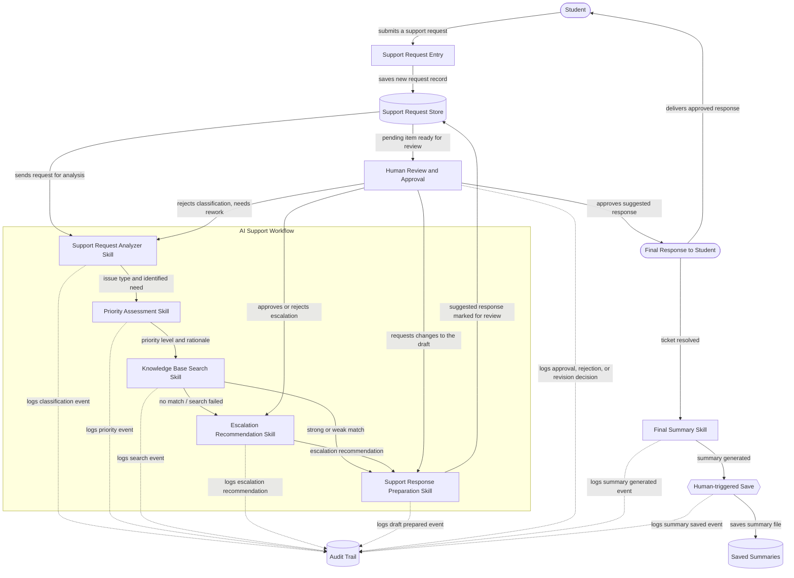

# Architecture: Student Support Workflow Assistant

## 1. The Idea

Student Support Workflow Assistant — An AI-powered support assistant for online students learning technical topics such as AI, Claude, APIs, MCP, SQL, and Power BI. When a student gets stuck understanding a concept or completing coursework, they can submit a support request. The AI reads the request, identifies the type of issue and its urgency, and prepares a suggested response or summary. However, the AI does not act on its own — a human reviewer must check and approve the result before it is finalized.

---

## 2. Components

| Component | What it does for this project | Exact words from the project idea that required this component |
|---|---|---|
| **Support Request Entry** | Gives the student a place to describe what they're stuck on and send that description into the system. | "they can submit a support request" |
| **Support Request Store** | Holds each request, and everything the AI produces about it, in one place from the moment it's submitted until a human has reviewed it — nothing can be "checked before it's finalized" if there's nowhere to hold it while it waits. | "a human reviewer must check and approve the result before it is finalized" |
| **AI Support Workflow** | The pipeline that takes a stored request and runs it through reading, classifying, prioritizing, searching the knowledge base, recommending escalation when needed, and drafting, in order, without acting on the result itself. | "The AI reads the request, identifies the type of issue and its urgency, and prepares a suggested response or summary" |
| **Human Review and Approval** | Gives a real person the chance to look at what the AI produced — the classification, the urgency, the knowledge base result, any escalation recommendation, and the draft response — and approve it, send it back, or fix it before it goes anywhere near the student. | "the AI does not act on its own — a human reviewer must check and approve the result before it is finalized" |
| **Audit Trail** | Keeps a record of what the AI decided, what the reviewer decided, and when, so the human-approval control above is provable after the fact and not just assumed to have happened. | Inferred from "a human reviewer must check and approve the result before it is finalized" — see Assumptions (§7) for why this is an inference rather than a literal quote. |

Five components. Each is either named directly in the idea or is infrastructure that the named requirement cannot function without. Issue classification, priority assessment, knowledge base search, escalation recommendation, response drafting, and final summary generation are **not** listed here as separate components — they are the six Skills the AI Support Workflow runs, detailed in §3.

---

## 3. Skills

| Skill | Purpose | Input | Output | When it runs | What it must NOT do | How it connects to the other Skills |
|---|---|---|---|---|---|---|
| **Support Request Analyzer Skill** | Reads the student's request and works out what they actually need help with, then classifies the type of issue. | The raw request text (plus basic metadata: student id, course/topic, timestamp). | A structured record: issue type/category, and a short statement of what the student needs. | First. Runs as soon as a new request is stored, before any other Skill touches it. | Must not assess urgency or priority, must not draft a response, must not decide what happens to the student. | Passes its structured output forward to the Priority Assessment Skill. Receives requests looped back to it if a human reviewer rejects the classification as wrong. |
| **Priority Assessment Skill** | Determines how urgent the request is, using the request itself plus the Analyzer's classification. | The original request + the Analyzer's issue-type output. | A priority level (e.g. low / medium / high / urgent) with a short rationale. | Second — after classification, before knowledge base search. | Must not make the final decision about what happens to the student; must not decide the content of the response; must not skip straight to drafting. | Receives its input from the Support Request Analyzer Skill. Passes its priority output forward to the Knowledge Base Search Skill. |
| **Knowledge Base Search Skill** | Searches the knowledge base for troubleshooting steps relevant to the student's issue, based on the classification already produced. | The Analyzer's classification (issue type + matched signals). | A search result: matched troubleshooting steps with a confidence level (strong or weak match), or an explicit "no match found" result. | Third — after classification and priority assessment, before response preparation. | Must not draft the response itself; must not decide escalation; must not fabricate steps not actually in the knowledge base. | Receives its input from the Priority Assessment Skill's output. Passes its search result forward to the Support Response Preparation Skill, and to the Escalation Recommendation Skill when no match is found. |
| **Escalation Recommendation Skill** | Decides whether the request needs to be escalated to a human specialist, based on whether the knowledge base search found a usable answer. | The Knowledge Base Search Skill's result (found/not found, confidence level). | An escalation recommendation: either "recommend escalation" with a plain-language explanation, or "not recommended," always requiring human approval before any real escalation happens. | Fourth — only when the Knowledge Base Search Skill returns no match or a search failure. | Must not escalate the ticket itself; must not decide the final outcome — a human must always approve or reject the recommendation; must not escalate just because confidence is low if a match was still found. | Receives its input from the Knowledge Base Search Skill. Its recommendation is reviewed and approved/rejected by a human, the same way the Support Request Analyzer Skill's classification is reviewed. |
| **Support Response Preparation Skill** | Prepares a suggested response, explanation, or summary that answers what the student asked, shaped by the issue type, priority, and knowledge base result already determined. | The original request + the Analyzer's classification + the Priority Assessment Skill's priority level + the Knowledge Base Search Skill's result. | A draft response, explanation, or summary, explicitly labeled as a suggestion pending human review. A weak/low-confidence knowledge base match is included with a caveat rather than being escalated. | Fifth — after classification, priority, and knowledge base search all exist. | Must not send the response directly to the student; must not remove or hide the "suggestion, not final" label; must not present itself as the final answer. | Receives its input from the Knowledge Base Search Skill (and the Escalation Recommendation Skill's output, when one exists). Hands its labeled draft to the human Review and Approval step. Receives requests looped back to it if a human reviewer asks for a revised draft. |
| **Final Summary Skill** | Compiles everything that happened on a ticket — the request, classification, review decision, knowledge base result, draft response, and any escalation — into one plain-text summary that can be saved with the ticket. | The full bundled workflow: ticket ID, request text, classification, classification review, knowledge base search result, draft response, and (if applicable) escalation recommendation/review. | A single, complete plain-text summary document for the ticket. | Last — only after the human reviewer has approved (or otherwise resolved) the classification, and after a draft response and any escalation decision already exist. | Must not save itself automatically — saving is a separate, explicit human-triggered action; must not produce a summary that claims an escalation happened if there's no matching escalation review actually present (a consistency check). | Receives its input from every prior Skill's output. Its output is what a human explicitly chooses to save — it doesn't hand off to another Skill. |

No seventh Skill is introduced. Routing a rejected item back to the Analyzer (reclassification) versus back to the Response Preparation Skill (a revised draft only) is a decision the human reviewer makes when they reject or request changes — it does not require a separate Skill of its own.

---

## 4. How It Fits Together

**Ordering justification:** Priority Assessment runs *before* Knowledge Base Search and Support Response Preparation, not after, because both the search and the draft have to be shaped by urgency as well as topic. Knowledge Base Search runs before drafting because the draft's content depends on what, if anything, was found. Escalation Recommendation only runs when the search comes up empty — a genuine no-match or a search failure — since that is the only case where the AI cannot offer a usable answer at all. This ordering also means the human reviewer sees issue type, urgency, search result, any escalation recommendation, and the draft together in one pending item, so they can triage without reading several separate records.

The diagram makes the control explicit: there is no path from any AI Skill to **Student** that does not pass through **Human Review and Approval**. The only arrow into **Final Response to Student** originates at the human-approval step.

---

## 5. Data Flow

1. The student submits a support request through the Support Request Entry surface, describing what they're stuck on (e.g., a login issue, a Power BI problem, an AI/Claude question).
2. The request text, plus basic metadata (student id, course/topic, timestamp), enters the system and is saved as a new record in the Support Request Store, in a `pending_analysis` state.
3. The Support Request Analyzer Skill reads the stored request, works out what the student needs, and classifies the issue type. This output — and the fact that it ran — is written to the Audit Trail.
4. The request and the Analyzer's output are passed to the Priority Assessment Skill, which determines urgency and produces a priority level with a short rationale. This is also logged to the Audit Trail.
5. The classification is passed to the Knowledge Base Search Skill, which searches for relevant troubleshooting steps. The result is one of: a strong match, a weak/low-confidence match, or no match at all. This search and its result are logged to the Audit Trail.
6. If the search found no match at all (or the search itself failed), the classification and search result are passed to the Escalation Recommendation Skill, which produces an escalation recommendation with a plain-language explanation. This recommendation is logged to the Audit Trail and must be approved or rejected by a human before any real escalation happens.
7. The Support Response Preparation Skill receives the original request, the classification, the priority level, and the knowledge base search result (strong match, weak match with a caveat, or an acknowledgment that no match was found), and drafts a suggested response, explanation, or summary — clearly labeled as a suggestion, not a final answer. The Audit Trail records that a draft was prepared.
8. The suggested response, along with the classification, priority, search result, and any escalation recommendation, is written back to the Support Request Store as one pending item and surfaced to a human reviewer through Human Review and Approval, in a `pending_review` state.
9. The human reviewer takes one of several actions, and each is written to the Audit Trail with who made the decision and when:
   - **Approve the draft** — the draft moves to `approved` and proceeds to step 10.
   - **Request changes to the draft** — the item goes back to the Support Response Preparation Skill for a revised draft, and returns to step 8 once redrafted.
   - **Reject the classification** — the item goes back to the Support Request Analyzer Skill for reclassification, and re-enters the workflow from step 3.
   - **Approve or reject an escalation recommendation** (if one exists) — recorded as its own decision, separate from approving the draft.
10. Once approved, the Final Response to Student is assembled from the approved draft and delivered to the student who submitted the original request. The record's state moves to `finalized`.
11. The Final Summary Skill compiles the entire ticket — request, classification, review decision, knowledge base result, draft response, and any escalation recommendation/review — into one plain-text summary. This step only runs once the ticket has reached a resolved state (finalized, or resolved via escalation).
12. Saving that summary is a separate, explicit, human-triggered action — the summary is not saved automatically the moment it's generated. Once a human chooses to save it, it's written to storage as one file per ticket, and that save action is logged to the Audit Trail.
13. Every step above — request submitted, classification produced, priority produced, search performed, escalation recommended (if applicable), draft produced, each human decision, the summary generated, and the summary saved — is recorded in the Audit Trail, so the full path from request to final response can be reconstructed after the fact.

---

## 6. Build Order (as actually built)

- **Phase 1 — Command Center and project foundation (STORY-000).** Built the project's own status dashboard, reading live from `.colaberry/plan.json` and `progress.json`, plus the working agreements (`CLAUDE.md`, `PROGRESS.md`) and repo setup. This came before any assistant logic, establishing the "never show a number the project hasn't actually produced" trust principle that shaped everything after it.

- **Phase 2 — Classify and prioritize requests (STORY-001).** Built the Support Request Analyzer Skill and Priority Assessment Skill together as one deterministic function, `classifySupportRequest()`. Also built the `presentToAgent()` guardrail, blocking any restricted action unless explicitly flagged for human approval — establishing the core "AI never acts alone" rule project-wide, not just for this story.

- **Phase 3 — Human review and approval of classification (STORY-002).** Built `reviewClassification()`, giving a human the ability to approve or reject the Analyzer's output, with reject routing back through reclassification. Scoped deliberately to classification only — reviewing the draft response and knowledge base recommendation was identified as a related but separate need, addressed in later stories.

- **Phase 4 — Audit trail logging (STORY-003).** Built `appendAuditEntry()`, a hash-chained, append-only, fail-closed logger. This is the phase that made every prior and future decision provable, not just claimed — matching the original design's intent that the human-approval control needs to be demonstrable after the fact.

- **Phase 5 — Knowledge base search (STORY-004).** Built the Knowledge Base Search Skill, searching a small hand-authored knowledge base and returning a strong match, weak/low-confidence match, or no match, each handled distinctly downstream.

- **Phase 6 — Draft response generation (STORY-005).** Built the Support Response Preparation Skill, turning classification + priority + knowledge base result into a clearly-labeled suggested reply, never sent automatically.

- **Phase 7 — Escalation recommendation (STORY-006).** Built the Escalation Recommendation Skill, triggering only on a true no-match or search failure — a deliberate scope decision, confirmed with the human reviewer, that a weak-but-found match stays at the drafting stage with a caveat instead of escalating.

- **Phase 8 — Final summary and manual save (STORY-007).** Built the Final Summary Skill and its separate, human-triggered save action, compiling the full ticket history into one document only after the workflow is complete — closing out the last requirement and completing the full 8-story build.

**How this differs from the original plan:** The original hypothetical design proposed building priority before drafting and review before audit logging, ending with an end-to-end test phase. What was actually built followed almost the same shape, but added the knowledge base search and escalation as their own dedicated phases (5 and 7) rather than folding them into drafting — and audit logging landed in phase 4, right after human review, rather than last, since provability was treated as core infrastructure rather than a final polish step. No single "test everything end-to-end" phase exists yet as a separate step — each story's own test suite (179/179 passing across the whole project) has served that role incrementally, though a true end-to-end orchestrator wiring all modules together in one live run is still an acknowledged gap, planned as the next piece of work.

---

## 7. Assumptions

| Assumption | Why it is being made | Impact if wrong |
|---|---|---|
| A request can wait an indefinite amount of time between AI processing and human review (the workflow is asynchronous, not a live chat). | The idea says a human "must check and approve the result before it is finalized," which only makes sense if there's a gap for a person to actually do that checking — a synchronous, instant-reply chat wouldn't leave room for a human step. | If requests actually need a live, real-time response, the Support Request Store's `pending_review` state becomes a bottleneck and the architecture would need a notification/urgency-driven reviewer queue instead of a simple store. |
| Audit trail logging is required infrastructure, even though the idea's text doesn't name it explicitly. | A human-approval control that can't be shown to have happened isn't a control a school or team could actually rely on — logging is the minimum needed to make "a human reviewer must check and approve" verifiable rather than just claimed. | If auditability truly isn't needed for this project's day-one scope, Phase 4 is unnecessary work that could be deferred without weakening the core promise (the approval gate itself doesn't depend on logging to function). |
| One human reviewer role is sufficient — no distinction between, say, a teaching assistant and an instructor. | The idea says only "a human reviewer," singular and unqualified, with no mention of reviewer tiers or routing rules. | If different issue types or priorities need to go to different reviewers, Human Review and Approval needs a routing/assignment layer, not just a single review queue. |
| The Support Response Preparation Skill produces text only (no code execution, no direct file changes, no LMS actions). | The idea describes "a suggested response or summary" — language output — not any action taken on coursework, grades, or systems. | If the assistant is expected to eventually take actions (e.g. resetting a password, regrading), a much stronger permissions and safety layer is needed before those actions could ever run, human-approved or not. |
| "Type of issue" (classification) and "urgency" (priority) are independent enough to be judged by two separate Skills rather than one combined step. | The idea explicitly separates them in one sentence ("identifies the type of issue and its urgency") and the required responsibilities list them as two Skills. Note: in the actual built code, both are produced by one function, `classifySupportRequest()` — they are kept conceptually separate here to preserve the clarity of two distinct responsibilities, even though the implementation combines them. | If in practice they're too entangled to score independently (e.g. issue type strongly determines urgency), the two-Skill split adds a coordination step without adding real accuracy, and could be simplified into one Skill later. |
| A weak/low-confidence knowledge base match should stay at the drafting stage with a caveat, rather than being escalated. | Confirmed as a deliberate scope decision during STORY-006: only a true no-match or search failure escalates, since the plain instructions ("escalate when the issue cannot be solved") don't specify what to do with a weak-but-found match. | If this proves too lenient in practice (students receiving low-confidence answers without enough warning), the threshold for escalation could be revisited to include weak matches as well. |

---

## 8. What This Design Does Not Cover

- **Fully autonomous responses to students.** Every response reaches a student only after a human has approved it — the AI never sends anything directly.
- **Replacing instructors or support staff.** The system prepares suggestions for a human to check; it does not remove the human from the loop or make final calls on the student's behalf.
- **Advanced student authentication.** How a student proves who they are before submitting a request is out of scope for this architecture; it assumes requests already arrive with a trustworthy student identifier.
- **Production-scale infrastructure.** Load balancing, horizontal scaling, multi-region deployment, and high-availability guarantees are not addressed — this design targets a working single-instance workflow, not a scaled service.
- **Complex integrations with learning management systems.** The architecture assumes requests and metadata enter through the Support Request Entry surface as described; it does not define how that surface would sync with an external LMS, gradebook, or course platform.
- **Automatic actions without human approval, of any kind.** Beyond just responses to students, this design does not cover the AI editing coursework, changing grades, resetting access, or taking any other action — its only output is a draft for a human to review.
- **A live, end-to-end orchestrator.** Every Skill and the audit trail are built and individually tested (179/179 tests passing across the project), but no runtime entry point yet assembles a real ticket and runs it through the full pipeline outside of a test file. This is a known, explicitly tracked gap, planned as the next piece of work.
- **Full parity between the presentation demo and the live system.** The presentation demo (used for the Expo/Demo Day) is a scripted walkthrough built to illustrate the workflow visually, and does not yet call every real function behind each button — for example, rejecting a classification in the demo shows "Agent rejected" without visually re-running and displaying the reclassification, even though the real `reviewClassification.js` code does this correctly and is covered by passing tests.

---

## 9. Day-One Success Criterion

**On day one, the system is successful if and only if a single, observable trace exists showing:**

1. A student submits a support request through Support Request Entry, and it is saved to the Support Request Store.
2. The Support Request Analyzer Skill produces a specific, correct issue-type classification for that request (verifiable by a human reading the request and agreeing with the classification).
3. The Priority Assessment Skill produces a specific, correct priority level for that same request (also verifiable by a human reading the request and agreeing with the urgency assigned).
4. The Knowledge Base Search Skill returns a result — a match with usable steps, or an honest "no match found" — that a human judges to be accurate given what's actually in the knowledge base.
5. If no match was found, the Escalation Recommendation Skill produces a recommendation with a clear explanation that a human judges to be reasonable.
6. The Support Response Preparation Skill produces a draft response, explanation, or summary, clearly labeled as a suggestion, that a human reviewer judges to be a genuinely usable answer to what the student asked — not generic filler.
7. A human reviewer sees exactly that classification, priority, search result, any escalation recommendation, and draft together, and takes explicit action on each: approve, request changes, or reject.
8. If approved, the exact approved content — and nothing the AI produced that the human did not approve — is what reaches the student as the final response.
9. The Final Summary Skill compiles the resolved ticket into one summary, and a human explicitly chooses to save it.
10. The Audit Trail contains a complete, ordered record of steps 2 through 9 for that request, showing who approved it and when.

This is testable today with one real (or realistic) student request run end to end: submit it, inspect the classification and priority for correctness, inspect the knowledge base result and any escalation recommendation, inspect the draft for usefulness, have a reviewer approve it, save the final summary, and confirm the audit trail shows the full chain. If any one of those ten checks fails — wrong classification, wrong priority, an unusable draft, a response that reaches the student without approval, or a gap in the audit trail — day one has not been achieved, regardless of whether the code runs without errors.
